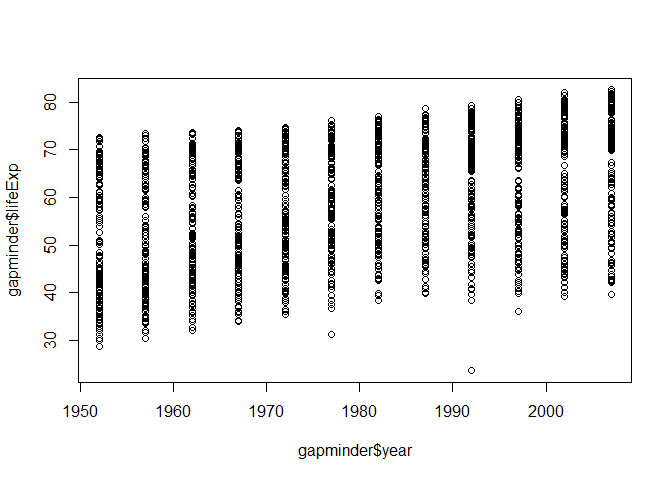

# Class work practice
Jonathan Agyeman  
26 September 2015  


## Performing analysis on gapminder

I first begin by calling the gapminder data and then exploring the data.


```r
library(gapminder)
str(gapminder) # look at structure of data
```

```
## 'data.frame':	1704 obs. of  6 variables:
##  $ country  : Factor w/ 142 levels "Afghanistan",..: 1 1 1 1 1 1 1 1 1 1 ...
##  $ continent: Factor w/ 5 levels "Africa","Americas",..: 3 3 3 3 3 3 3 3 3 3 ...
##  $ year     : num  1952 1957 1962 1967 1972 ...
##  $ lifeExp  : num  28.8 30.3 32 34 36.1 ...
##  $ pop      : num  8425333 9240934 10267083 11537966 13079460 ...
##  $ gdpPercap: num  779 821 853 836 740 ...
```

```r
head(gapminder) #call top six rows
```

```
##       country continent year lifeExp      pop gdpPercap
## 1 Afghanistan      Asia 1952  28.801  8425333  779.4453
## 2 Afghanistan      Asia 1957  30.332  9240934  820.8530
## 3 Afghanistan      Asia 1962  31.997 10267083  853.1007
## 4 Afghanistan      Asia 1967  34.020 11537966  836.1971
## 5 Afghanistan      Asia 1972  36.088 13079460  739.9811
## 6 Afghanistan      Asia 1977  38.438 14880372  786.1134
```

```r
tail(gapminder) #call last six rows
```

```
##       country continent year lifeExp      pop gdpPercap
## 1699 Zimbabwe    Africa 1982  60.363  7636524  788.8550
## 1700 Zimbabwe    Africa 1987  62.351  9216418  706.1573
## 1701 Zimbabwe    Africa 1992  60.377 10704340  693.4208
## 1702 Zimbabwe    Africa 1997  46.809 11404948  792.4500
## 1703 Zimbabwe    Africa 2002  39.989 11926563  672.0386
## 1704 Zimbabwe    Africa 2007  43.487 12311143  469.7093
```

```r
gapminder[sample(nrow(gapminder),10),] # sample 10 rows randomly
```

```
##                country continent year lifeExp      pop gdpPercap
## 387               Cuba  Americas 1962  65.246  7254373 5180.7559
## 1329           Senegal    Africa 1992  58.196  8307920 1367.8994
## 577              Ghana    Africa 1952  43.149  5581001  911.2989
## 338        Congo, Rep.    Africa 1957  45.053   940458 2315.0566
## 1573            Turkey    Europe 1952  43.585 22235677 1969.1010
## 1533          Thailand      Asia 1992  67.298 56667095 4616.8965
## 1687            Zambia    Africa 1982  51.821  6100407 1408.6786
## 490  Equatorial Guinea    Africa 1997  48.245   439971 2814.4808
## 1704          Zimbabwe    Africa 2007  43.487 12311143  469.7093
## 1532          Thailand      Asia 1987  66.084 52910342 2982.6538
```

```r
names(gapminder) # variable names of data set
```

```
## [1] "country"   "continent" "year"      "lifeExp"   "pop"       "gdpPercap"
```

```r
dim(gapminder) # dimension of data set
```

```
## [1] 1704    6
```

```r
summary(gapminder) # a quick summary of all the variables in the data set
```

```
##         country        continent        year         lifeExp     
##  Afghanistan:  12   Africa  :624   Min.   :1952   Min.   :23.60  
##  Albania    :  12   Americas:300   1st Qu.:1966   1st Qu.:48.20  
##  Algeria    :  12   Asia    :396   Median :1980   Median :60.71  
##  Angola     :  12   Europe  :360   Mean   :1980   Mean   :59.47  
##  Argentina  :  12   Oceania : 24   3rd Qu.:1993   3rd Qu.:70.85  
##  Australia  :  12                  Max.   :2007   Max.   :82.60  
##  (Other)    :1632                                                
##       pop              gdpPercap       
##  Min.   :6.001e+04   Min.   :   241.2  
##  1st Qu.:2.794e+06   1st Qu.:  1202.1  
##  Median :7.024e+06   Median :  3531.8  
##  Mean   :2.960e+07   Mean   :  7215.3  
##  3rd Qu.:1.959e+07   3rd Qu.:  9325.5  
##  Max.   :1.319e+09   Max.   :113523.1  
## 
```

```r
class(gapminder) # class of the data set
```

```
## [1] "data.frame"
```

```r
class(gapminder$continent) # the class of continent variable
```

```
## [1] "factor"
```

```r
nlevels(gapminder$continent) # number of levels the continent variable has
```

```
## [1] 5
```

```r
levels(gapminder$continent) # names of levels of continent variable
```

```
## [1] "Africa"   "Americas" "Asia"     "Europe"   "Oceania"
```

```r
table(gapminder$continent) # count of the continent variable under various levels
```

```
## 
##   Africa Americas     Asia   Europe  Oceania 
##      624      300      396      360       24
```

*************************************************************************************
## Exploring data using plots

Now I explore the variables in the data set using r plots functions.


```r
plot(lifeExp ~ year, gapminder) # This plots lifeExp against year without attaching data set.
```

 

```r
plot(gapminder$year, gapminder$lifeExp) # this gives the same plot
```

 

```r
plot(lifeExp ~ gdpPercap, gapminder) 
```

 

```r
plot(lifeExp ~ log(gdpPercap), gapminder) # transforming the gdpPercap data for a better plot
```

 

```r
hist(gapminder$lifeExp) # histogram of the lifeExp variable for individual summaries
```

 

```r
barplot(table(gapminder$continent)) # barplot of the continents
```

 
----------

## Exploring data using ggplot2

I now try out the plot functions of the ggplot2


```r
library(ggplot2) # call ggplot2 package

p <- ggplot(gapminder, aes(x = gdpPercap, y = lifeExp)) # call the function for variable are being used in the plot.

p + geom_point() # plots a scatter plot.
```

 

```r
p + scale_x_log10() + geom_point() # plots the scatter plot and logs the x varaible
```

 

```r
p <- p + scale_x_log10() 

p + geom_point(aes(color = continent)) # gives a plot with color coding for the continents
```

 

```r
p + geom_point(alpha = 0.05)# alpha is used to control the transparency of the points in the plot. The lower the value of alpha the more transparent the points.
```

 

```r
p + geom_point(aes(color=continent), alpha = (1), size = 2) # we can determine the color, the transparency and the size of the points in the plot.
```

 
Note that the `echo = FALSE` parameter was added to the code chunk to prevent printing of the R code that generated the plot.
